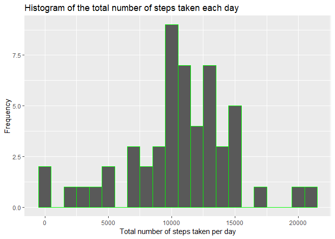
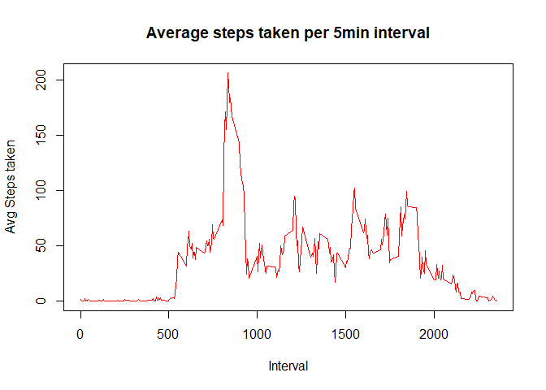
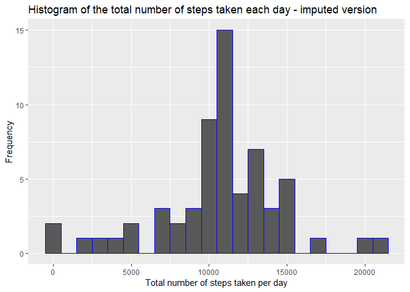
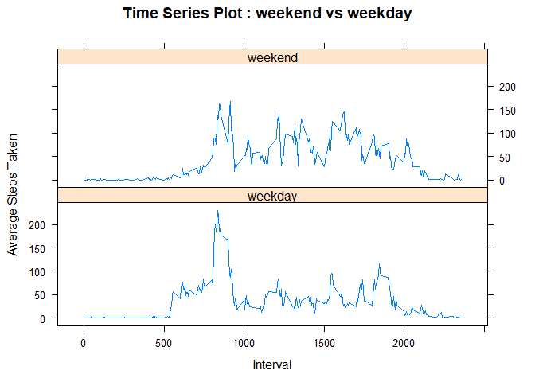

## Loading and preprocessing the data

```r
knitr::opts_chunk$set(echo = TRUE)
Sys.setlocale("LC_ALL","English")   # in order to correctly detect weekends
```

```
## [1] "LC_COLLATE=English_United States.1252;LC_CTYPE=English_United States.1252;LC_MONETARY=English_United States.1252;LC_NUMERIC=C;LC_TIME=English_United States.1252"
```

```r
library(dplyr)
```

```
## 
## Attaching package: 'dplyr'
```

```
## The following objects are masked from 'package:stats':
## 
##     filter, lag
```

```
## The following objects are masked from 'package:base':
## 
##     intersect, setdiff, setequal, union
```

```r
library(knitr)
library(ggplot2)

# Link to data file  
zipUrl  <- "https://d396qusza40orc.cloudfront.net/repdata%2Fdata%2Factivity.zip"
zipFile <- "activity.zip"

# Downloading dataset
if (!file.exists(zipFile)) {
	download.file(zipUrl, zipFile, mode = "wb") }

# unzipping zip file containing data if data directory doesn't already exist
dataPath <- "activity.csv"
if (!file.exists(dataPath)) {
  unzip(zipFile)   }

ActivityTab <- read.csv( dataPath ,header = TRUE, sep = ',')
# Conversion of convert date string to date datatype
ActivityTab$date <- as.Date( ActivityTab$date )
 str( ActivityTab )
```

```
## 'data.frame':	17568 obs. of  3 variables:
##  $ steps   : int  NA NA NA NA NA NA NA NA NA NA ...
##  $ date    : Date, format: "2012-10-01" "2012-10-01" ...
##  $ interval: int  0 5 10 15 20 25 30 35 40 45 ...
```


## What is mean total number of steps taken per day?

```r
#  Calculate the total number of steps taken per day
TotStepsPerDay <- aggregate( steps~date, data=ActivityTab , sum , na.rm=TRUE)
#  Make a histogram of the total number of steps taken each day
ggplot(TotStepsPerDay, aes(x=TotStepsPerDay$steps)) + 
  geom_histogram(binwidth=1000 , color="green") +
  labs( title="Histogram of the total number of steps taken each day" ,
        x="Total number of steps taken per day" , 
        y= "Frequency" )
```

<!-- -->

```r
#  Calculate and report the mean and median of the total number of steps taken per day
MeanTotStepDaily <- mean( TotStepsPerDay$steps, na.rm=TRUE)
MedianTotStepDaily <- median( TotStepsPerDay$steps, na.rm=TRUE)
```

###  Calculate and report the mean and median of the total number of steps taken per day
The mean of steps taken per day is 10766.
The median of steps taken per day is 10765 (ignoring missing values). 

## What is the average daily activity pattern?
###  Make a time series plot (i.e. type = "l" of the 5-minute interval (x-axis) and the average number of steps taken, averaged across all days (y-axis)


```r
#   Make a time series plot (i.e. type = "l" of the 5-minute interval (x-axis) and the average number of steps taken, averaged across all days (y-axis)

#DailyPattern <- aggregate(list(avg_steps = ActivityTab$steps ) , by=list(ActivityTab$interval), FUN=mean, na.rm=TRUE) 
#DailyPattern <- aggregate(ActivityTab$steps, by=list(ActivityTab$interval), FUN=mean, na.rm=TRUE)

DailyPattern <- aggregate( steps~interval, data=ActivityTab , FUN=mean , na.rm=TRUE) 
colnames(DailyPattern) <- c('interval' , 'avg_steps')

plot( x=DailyPattern[,1], 
      y=DailyPattern[,2], 
      type="l",
      col="red",
      main="Average steps taken per 5min interval",
      ylab="Avg Steps taken", 
      xlab="Interval")
```

<!-- -->

```r
#    Which 5-minute interval, on average across all the days in the dataset, contains the maximum number of steps?
MaxInterval <- DailyPattern[which.max(DailyPattern[,2]),1]
```
###    Which 5-minute interval, on average across all the days in the dataset, contains the maximum number of steps?
The interval with maximum average number of steps is 835.

## Imputing missing values

```r
# Note that there are a number of days/intervals where there are missing values (coded as NA). The presence of missing days may introduce bias into some calculations or summaries of the data.

#    Calculate and report the total number of missing values in the dataset (i.e. the total number of rows with NAs)
NumNas   <- sum(is.na(ActivityTab))
NumCompl <- sum(complete.cases(ActivityTab))
#    Devise a strategy for filling in all of the missing values in the dataset. The strategy does not need to be sophisticated. For example, you could use the mean/median for that day, or the mean for that 5-minute interval, etc.

ActivityTabCompl <- merge(ActivityTab , DailyPattern ,by="interval")
ActivityTabCompl$steps <- ifelse( is.na(ActivityTabCompl$steps), round(ActivityTabCompl$avg_steps), ActivityTabCompl$steps )
#    Create a new dataset that is equal to the original dataset but with the missing data filled in.

#    Make a histogram of the total number of steps taken each day and Calculate and report the mean and median total number of steps taken per day. Do these values differ from the estimates from the first part of the assignment? What is the impact of imputing missing data on the estimates of the total daily number of steps?
TotStepsPerDayImputed <- aggregate( steps~date, data=ActivityTabCompl , sum , na.rm=TRUE)

ggplot(TotStepsPerDayImputed, aes(x=TotStepsPerDayImputed$steps)) + 
  geom_histogram(binwidth=1000 , color="blue") +
  labs( title="Histogram of the total number of steps taken each day - imputed version" ,
        x="Total number of steps taken per day" , 
        y= "Frequency" )
```

<!-- -->

```r
MeanTotStepDailyImputed <- mean( TotStepsPerDay$steps, na.rm=TRUE)
MedianTotStepDailyImputed <- median( TotStepsPerDay$steps, na.rm=TRUE)
```
###    Calculate and report the total number of missing values in the dataset (i.e. the total number of rows with NAs)
Total number of rows with NAs is 2304

I use strategy of replacing NA values with mean value of that interval over all set rounded to nearest integer (to preserve character of data set).

After "repairing" NA values the mean of steps taken per day is 10766.
The median of steps taken per day is 10765.

### What is the impact of imputing missing data on the estimates of the total daily number of steps?
There is no significant impact on mean/median because :
- evaluation of estimates ignoring NA Values ;
- replacing NA values with means for specific interval over all data set.
There is significant impact on shape of histogram, cause about 2000 more examples are considered.

## Are there differences in activity patterns between weekdays and weekends?
### Make a panel plot containing a time series plot (i.e. type = "l") of the 5-minute interval (x-axis) and the average number of steps taken, averaged across all weekday days or weekend days (y-axis).
  

```r
# For this part the weekdays() function may be of some help here. Use the dataset with the filled-in missing values for this part.

#    Create a new factor variable in the dataset with two levels -- "weekday" and "weekend" indicating whether a given date is a weekday or weekend day.
ActivityTabCompl$daytype <- ifelse(weekdays(ActivityTabCompl$date) %in% c("Sunday", "Saturday") , 'weekend' , 'weekday')

#    Make a panel plot containing a time series plot (i.e. type = "l") of the 5-minute interval (x-axis) and the average number of steps taken, averaged across all weekday days or weekend days (y-axis). The plot should look something like the following, which was created using simulated data:
DayPatternPerType <- aggregate(steps ~ interval + daytype, data=ActivityTabCompl , mean)

library(lattice)
xyplot( steps ~ interval | daytype, DayPatternPerType , type = "l", layout = c(1,2), main = "Time Series Plot : weekend vs weekday", xlab = "Interval", ylab = "Average Steps Taken")
```

<!-- -->
  The main differences between weekend and weekday averaged patterns are :
  - Earlier start and end of intensive activity on weekdays ;
  - greater absolute peak values on weekdays.
  
  
